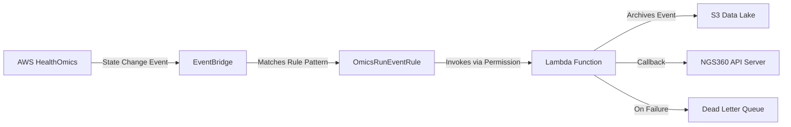

# Plan: Add EventBridge Rule to CloudFormation Template

## Overview
Add an EventBridge rule to the [`ngs360-omics-run-event-processor.yaml`](../ngs360-omics-run-event-processor.yaml) CloudFormation template to automatically trigger the Lambda function when AWS HealthOmics run state changes occur.

## Current State Analysis

The existing template includes:
- ✅ Lambda function ([`OmicsRunEventProcessorFunction`](../ngs360-omics-run-event-processor.yaml:77))
- ✅ Lambda execution role with S3 and SNS permissions
- ✅ Dead letter queue (SNS topic)
- ✅ VPC configuration
- ❌ **Missing**: EventBridge rule to trigger the Lambda
- ❌ **Missing**: Lambda permission for EventBridge invocation

## Required Changes

### 1. Add EventBridge Rule Resource

**Resource Name**: `OmicsRunEventRule`

**Purpose**: Captures AWS HealthOmics run status change events and routes them to the Lambda function

**Configuration**:
```yaml
OmicsRunEventRule:
  Type: AWS::Events::Rule
  Properties:
    Name: ngs360-omics-run-event-processor-rule
    Description: Triggers Lambda function when AWS HealthOmics run status changes
    State: ENABLED
    EventPattern:
      source:
        - aws.omics
      detail-type:
        - Omics Run Status Change
    Targets:
      - Arn: !GetAtt OmicsRunEventProcessorFunction.Arn
        Id: OmicsRunEventProcessorTarget
```

**Key Properties**:
- **EventPattern**: Filters for `source=aws.omics` and `detail-type=Omics Run Status Change`
- **State**: `ENABLED` - rule is active immediately upon creation
- **Targets**: Points to the Lambda function ARN
- **Id**: Unique identifier for the target within this rule

### 2. Add Lambda Permission Resource

**Resource Name**: `LambdaInvokePermission`

**Purpose**: Grants EventBridge service permission to invoke the Lambda function

**Configuration**:
```yaml
LambdaInvokePermission:
  Type: AWS::Lambda::Permission
  Properties:
    FunctionName: !Ref OmicsRunEventProcessorFunction
    Action: lambda:InvokeFunction
    Principal: events.amazonaws.com
    SourceArn: !GetAtt OmicsRunEventRule.Arn
```

**Key Properties**:
- **FunctionName**: References the Lambda function
- **Action**: Allows `lambda:InvokeFunction`
- **Principal**: `events.amazonaws.com` (EventBridge service)
- **SourceArn**: Scopes permission to only this specific EventBridge rule

### 3. Update Outputs Section

Add the following outputs for visibility and reference:

```yaml
EventBridgeRuleName:
  Description: Name of the EventBridge rule triggering the Lambda function
  Value: !Ref OmicsRunEventRule
  
EventBridgeRuleArn:
  Description: ARN of the EventBridge rule
  Value: !GetAtt OmicsRunEventRule.Arn
```

### 4. IAM Permissions Review

**Analysis**: No changes needed to the Lambda execution role.

**Rationale**:
- EventBridge invocation is authorized via [`AWS::Lambda::Permission`](../ngs360-omics-run-event-processor.yaml), not IAM role policies
- Lambda already has necessary permissions for its operations (S3, SNS, VPC, CloudWatch Logs)
- EventBridge doesn't require the Lambda to have specific permissions to receive events

## Template Structure

The resources will be added in the following order within the `Resources` section:

```
Resources:
  DeadLetterQueue          (existing)
  LambdaExecutionRole      (existing)
  OmicsRunEventProcessorFunction (existing)
  OmicsRunEventRule        (NEW - after Lambda)
  LambdaInvokePermission   (NEW - after EventBridge rule)
```

## Event Flow Diagram



## Benefits of This Approach

1. **Automated Triggering**: No manual setup required - EventBridge rule is created with the stack
2. **Infrastructure as Code**: Complete deployment in a single CloudFormation template
3. **Least Privilege**: Lambda permission scoped to specific EventBridge rule ARN
4. **Maintainability**: All resources managed together in version control
5. **Visibility**: CloudFormation outputs provide easy reference to rule details

## Testing Plan

After deployment, verify:
1. EventBridge rule exists and is ENABLED
2. Rule target points to correct Lambda function
3. Lambda permission exists with correct principal and source ARN
4. Trigger a test HealthOmics run and verify event processing
5. Check CloudWatch Logs for successful Lambda invocations
6. Verify event archived to S3
7. Confirm callback sent to NGS360 API server

## Rollback Considerations

If issues arise:
- EventBridge rule can be disabled via `State: DISABLED` without deleting
- Rolling back the CloudFormation stack removes all new resources
- Existing Lambda function continues to work (can be invoked manually/via other triggers)

## Documentation Updates

The [`README.md`](../README.md:140) currently states (lines 140-152):

> "The Lambda function processes EventBridge events from AWS HealthOmics. To set up event routing:
> 1. Create an EventBridge rule to trigger this Lambda function
> 2. Configure the rule to filter for HealthOmics state change events"

**Recommended Update**: Change this section to reflect that EventBridge is now included in the CloudFormation template.

## Summary

This plan adds two new CloudFormation resources to automate EventBridge integration:
- [`AWS::Events::Rule`](../ngs360-omics-run-event-processor.yaml) - captures HealthOmics events
- [`AWS::Lambda::Permission`](../ngs360-omics-run-event-processor.yaml) - authorizes EventBridge to invoke Lambda

These changes complete the infrastructure-as-code deployment, eliminating manual EventBridge setup steps and ensuring consistent deployments across environments.
