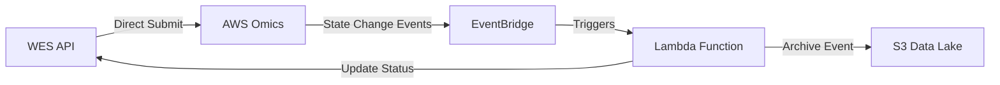
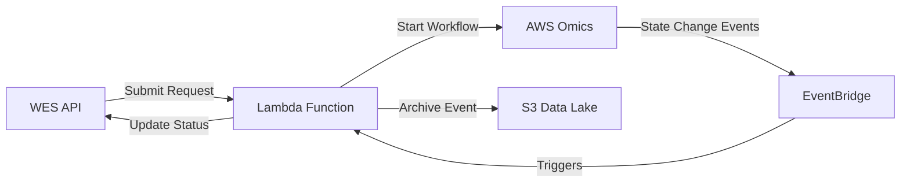

# Reverse Workflow Submission Architecture Plan

## Executive Summary

This plan outlines the changes needed to reverse the workflow submission direction so that the GA4GH WES API triggers workflow submissions through the Lambda function, which then submits to AWS Omics, rather than the WES API submitting directly to Omics.

## Current Architecture



**Current Flow:**
1. User submits workflow via WES API
2. WES API OmicsExecutor directly calls AWS Omics `start_run`
3. Omics runs workflow and emits state change events
4. EventBridge captures events and triggers Lambda
5. Lambda archives event to S3 and calls WES API callback endpoint
6. WES API updates run status in database

## Proposed Architecture



**New Flow:**
1. User submits workflow via WES API
2. WES API calls Lambda function with workflow submission payload
3. Lambda validates request and calls AWS Omics `start_run`
4. Lambda returns Omics run ID to WES API
5. Omics runs workflow and emits state change events (existing flow)
6. EventBridge captures events and triggers Lambda (existing flow)
7. Lambda archives event and calls WES API callback (existing flow)

## Benefits of New Architecture

1. **Centralized Omics Interaction**: Single point of control for all Omics API calls
2. **Consistent Error Handling**: Both submission and status updates handled by same Lambda
3. **Enhanced Security**: WES API doesn't need direct Omics permissions
4. **Better Auditing**: All Omics operations logged through Lambda
5. **Simplified VPC Configuration**: WES API can be isolated from Omics service endpoints

## Implementation Plan

### 1. Lambda Function Changes

#### A. Add Workflow Submission Handler

**File:** [`lambda.py`](lambda.py:1)

Add a new handler function to process workflow submission requests:

```python
def submit_workflow_handler(event, context):
    """
    Handle workflow submission requests from WES API
    
    Expected event structure:
    {
        "action": "submit_workflow",
        "wes_run_id": "uuid-string",
        "workflow_id": "wf-12345",
        "workflow_type": "CWL",
        "parameters": {...},
        "workflow_engine_parameters": {
            "name": "workflow-name",
            "outputUri": "s3://bucket/path/",
            "cacheId": "cache-123",
            "priority": 5
        },
        "tags": {
            "project": "project-name",
            "WESRunId": "uuid-string"
        }
    }
    
    Returns:
    {
        "statusCode": 200,
        "omics_run_id": "1234567",
        "message": "Workflow submitted successfully"
    }
    """
```

**Key responsibilities:**
- Validate input parameters
- Convert WES parameters to Omics format
- Call `omics_client.start_run()`
- Tag Omics run with WESRunId
- Return Omics run ID to caller
- Handle errors and return appropriate status codes

#### B. Update Main Lambda Handler

**File:** [`lambda.py`](lambda.py:345)

Modify `lambda_handler` to route between event types:

```python
def lambda_handler(event, context):
    """
    Main router for Lambda function
    Routes to appropriate handler based on event source
    """
    logger = setup_logging(event)
    
    # Check if this is a workflow submission request
    if event.get('action') == 'submit_workflow':
        return submit_workflow_handler(event, context)
    
    # Otherwise, handle as EventBridge event (existing logic)
    return process_state_change_event(event, context)
```

### 2. CloudFormation Template Updates

**File:** [`ngs360-omics-run-event-processor.yaml`](ngs360-omics-run-event-processor.yaml:1)

#### A. Add IAM Permissions for Workflow Submission

Update [`LambdaExecutionRole`](ngs360-omics-run-event-processor.yaml:56) with additional Omics permissions:

```yaml
- PolicyName: OmicsAccess
  PolicyDocument:
    Version: "2012-10-17"
    Statement:
      - Effect: Allow
        Action:
          - omics:GetRun
          - omics:ListRuns
          - omics:ListRunTasks
          - omics:StartRun          # NEW: Allow workflow submission
          - omics:TagResource        # NEW: Allow tagging runs
        Resource: "*"
```

#### B. Create Lambda Function URL

Add a Function URL for synchronous invocation from WES API:

```yaml
OmicsRunEventProcessorFunctionUrl:
  Type: AWS::Lambda::Url
  Properties:
    AuthType: AWS_IAM
    TargetFunctionArn: !GetAtt OmicsRunEventProcessorFunction.Arn
    InvokeMode: BUFFERED

OmicsRunEventProcessorFunctionUrlPermission:
  Type: AWS::Lambda::Permission
  Properties:
    FunctionName: !Ref OmicsRunEventProcessorFunction
    Action: lambda:InvokeFunctionUrl
    Principal: "*"
    FunctionUrlAuthType: AWS_IAM
```

**Alternative: API Gateway**
If more control is needed, use API Gateway REST API instead:

```yaml
WorkflowSubmissionApi:
  Type: AWS::ApiGateway::RestApi
  Properties:
    Name: ngs360-omics-workflow-submission
    Description: API for WES to submit workflows to Omics
    EndpointConfiguration:
      Types:
        - REGIONAL

WorkflowSubmissionResource:
  Type: AWS::ApiGateway::Resource
  Properties:
    RestApiId: !Ref WorkflowSubmissionApi
    ParentId: !GetAtt WorkflowSubmissionApi.RootResourceId
    PathPart: submit

WorkflowSubmissionMethod:
  Type: AWS::ApiGateway::Method
  Properties:
    RestApiId: !Ref WorkflowSubmissionApi
    ResourceId: !Ref WorkflowSubmissionResource
    HttpMethod: POST
    AuthorizationType: AWS_IAM
    Integration:
      Type: AWS_PROXY
      IntegrationHttpMethod: POST
      Uri: !Sub arn:aws:apigateway:${AWS::Region}:lambda:path/2015-03-31/functions/${OmicsRunEventProcessorFunction.Arn}/invocations
```

#### C. Add Output for Lambda Endpoint

```yaml
Outputs:
  LambdaFunctionName:
    Description: Name of the Omics Run Event Processor Lambda Function
    Value: !Ref OmicsRunEventProcessorFunction
  
  LambdaFunctionUrl:
    Description: Function URL for workflow submission
    Value: !GetAtt OmicsRunEventProcessorFunctionUrl.FunctionUrl
    Export:
      Name: !Sub ${AWS::StackName}-FunctionUrl
```

#### D. Add Parameters for WES API Access

```yaml
Parameters:
  # ... existing parameters ...
  
  AllowedWesApiRole:
    Type: String
    Description: IAM Role ARN that WES API uses (for Lambda Function URL auth)
```

### 3. WES API Changes

#### A. Update OmicsExecutor

**File:** `../BMS-NGS360-Deployment/GA4GH-WES-API-Service/src/wes_service/daemon/executors/omics.py`

Replace direct Omics API calls with Lambda invocation:

**Current approach (lines ~102-230):**
```python
def execute(self, db: Session, run: WorkflowRun) -> WorkflowState:
    # ... extract workflow_id ...
    # ... prepare parameters ...
    
    # CURRENT: Direct call to Omics
    response = self.omics_client.start_run(**kwargs)
    omics_run_id = response['id']
```

**New approach:**
```python
def execute(self, db: Session, run: WorkflowRun) -> WorkflowState:
    # ... extract workflow_id ...
    # ... prepare parameters ...
    
    # NEW: Call Lambda function instead
    lambda_payload = {
        'action': 'submit_workflow',
        'wes_run_id': run.id,
        'workflow_id': workflow_id,
        'workflow_type': run.workflow_type,
        'parameters': omics_params,
        'workflow_engine_parameters': run.workflow_engine_parameters or {},
        'tags': {
            **run.tags,
            'WESRunId': run.id
        }
    }
    
    lambda_response = self._invoke_lambda_submit(lambda_payload)
    omics_run_id = lambda_response['omics_run_id']
```

**New helper method:**
```python
def _invoke_lambda_submit(self, payload: Dict[str, Any]) -> Dict[str, Any]:
    """
    Invoke Lambda function to submit workflow to Omics.
    
    Args:
        payload: Workflow submission payload
        
    Returns:
        Lambda response containing omics_run_id
    """
    import boto3
    import json
    
    lambda_client = boto3.client('lambda', region_name=self.region)
    
    response = lambda_client.invoke(
        FunctionName=self.settings.omics_lambda_function_name,
        InvocationType='RequestResponse',
        Payload=json.dumps(payload)
    )
    
    response_payload = json.loads(response['Payload'].read())
    
    if response['StatusCode'] != 200:
        raise Exception(f"Lambda invocation failed: {response_payload}")
    
    if response_payload.get('statusCode') != 200:
        error_msg = response_payload.get('message', 'Unknown error')
        raise Exception(f"Workflow submission failed: {error_msg}")
    
    return response_payload
```

#### B. Update WES API Configuration

**File:** `../BMS-NGS360-Deployment/GA4GH-WES-API-Service/src/wes_service/config.py`

Add Lambda configuration settings:

```python
class Settings(BaseSettings):
    # ... existing settings ...
    
    # AWS Omics Configuration
    omics_region: str = Field(
        default="us-east-1",
        description="AWS region for Omics service",
    )
    omics_lambda_function_name: str = Field(
        default="",
        description="Lambda function name for workflow submission",
    )
    # Remove or deprecate:
    # omics_role_arn: str  # No longer needed by WES API
```

#### C. Update WES API IAM Role

The WES API execution role needs permission to invoke the Lambda function:

```json
{
  "Version": "2012-10-17",
  "Statement": [
    {
      "Effect": "Allow",
      "Action": [
        "lambda:InvokeFunction"
      ],
      "Resource": "arn:aws:lambda:REGION:ACCOUNT:function:ngs360-omics-run-event-processor*"
    }
  ]
}
```

### 4. Parameter Conversion Logic

The Lambda function needs to convert WES parameters to Omics format. This logic can be extracted from the existing OmicsExecutor:

**Key conversions:**
1. **File paths**: Convert NGS360 file IDs to S3 paths
2. **CWL format**: Handle `class: File`, `class: Directory` objects
3. **Array parameters**: Process lists of files
4. **Excluded parameters**: Filter out `workflow_id` (used for API, not workflow input)

**Example conversion function:**
```python
def convert_wes_params_to_omics(wes_params: Dict, workflow_type: str) -> Dict:
    """
    Convert WES workflow parameters to Omics format.
    
    For CWL workflows:
    - {"input_file": {"class": "File", "path": "file:///data/input.txt"}}
    - Becomes: {"input_file": {"class": "File", "path": "s3://bucket/input.txt"}}
    
    For other workflows:
    - {"input_file": "file:///data/input.txt"}
    - Becomes: {"input_file": "s3://bucket/input.txt"}
    """
    omics_params = {}
    
    for key, value in wes_params.items():
        if key == 'workflow_id':
            continue  # Exclude workflow_id from parameters
            
        if isinstance(value, dict) and 'class' in value:
            # CWL File/Directory object
            if 'path' in value:
                value['path'] = convert_file_path_to_s3(value['path'])
            omics_params[key] = value
            
        elif isinstance(value, list):
            # Array of files/values
            processed_list = []
            for item in value:
                if isinstance(item, dict) and 'path' in item:
                    item['path'] = convert_file_path_to_s3(item['path'])
                processed_list.append(item)
            omics_params[key] = processed_list
            
        elif isinstance(value, str) and (value.startswith('file://') or value.startswith('NGS360:')):
            # Simple file path
            omics_params[key] = convert_file_path_to_s3(value)
            
        else:
            # Other parameters
            omics_params[key] = value
    
    return omics_params
```

### 5. Error Handling and Validation

#### A. Lambda Function Validation

**Input validation:**
- Required fields: `action`, `wes_run_id`, `workflow_id`
- Valid workflow_id format (must start with `wf-`)
- Parameters must be valid JSON
- Output URI must be valid S3 path

**Error responses:**
```python
# 400 Bad Request
{
    "statusCode": 400,
    "error": "Invalid workflow_id format",
    "message": "workflow_id must start with 'wf-'"
}

# 500 Internal Server Error
{
    "statusCode": 500,
    "error": "OmicsSubmissionError",
    "message": "Failed to submit workflow to Omics: <error details>"
}
```

#### B. WES API Error Handling

The OmicsExecutor should catch Lambda invocation errors and update run state appropriately:

```python
try:
    lambda_response = self._invoke_lambda_submit(lambda_payload)
    omics_run_id = lambda_response['omics_run_id']
except Exception as e:
    logger.error(f"Failed to submit workflow via Lambda: {str(e)}")
    run.state = WorkflowState.SYSTEM_ERROR
    run.system_logs.append(f"Submission failed: {str(e)}")
    run.end_time = datetime.now(timezone.utc)
    db.commit()
    return WorkflowState.SYSTEM_ERROR
```

### 6. Security Considerations

#### A. Authentication & Authorization

**Lambda Function URL:**
- Use AWS_IAM authentication
- WES API uses IAM role to invoke
- Validate caller identity in Lambda

**API Gateway (Alternative):**
- IAM authorization with resource policies
- Request validation
- Rate limiting and throttling

#### B. Network Security

**Option 1: VPC-to-VPC (Recommended)**
- Keep Lambda in VPC
- Use VPC peering or Transit Gateway
- WES API calls Lambda via private endpoint

**Option 2: Public Endpoint with IAM Auth**
- Lambda Function URL with IAM auth
- WES API signs requests with SigV4
- Security groups control Lambda outbound access

#### C. Secrets Management

- Lambda retrieves Omics IAM role from environment variables
- No credentials passed in request payload
- Use AWS Secrets Manager for any API keys

### 7. Logging and Monitoring

#### A. Lambda Function Logs

**Workflow Submission:**
```
[INFO] Received workflow submission request: wes_run_id=abc-123, workflow_id=wf-456
[INFO] Converted parameters for Omics: {"input_file": "s3://..."}
[INFO] Starting Omics run with parameters: {...}
[INFO] Successfully started Omics run: omics_run_id=7891011
[INFO] Returning response to WES API
```

**State Change Processing (Existing):**
```
[INFO] Received event: omics_run_id=7891011, status=RUNNING
[INFO] Calling WES API callback endpoint
[INFO] Successfully updated run status in WES API
```

#### B. CloudWatch Metrics

Add custom metrics:
- `WorkflowSubmissions` - Count of submission requests
- `SubmissionErrors` - Count of failed submissions
- `SubmissionLatency` - Time to submit to Omics

#### C. WES API Logs

```python
logger.info(f"Submitting workflow {run.id} to Omics via Lambda")
logger.info(f"Lambda returned omics_run_id: {omics_run_id}")
```

### 8. Testing Strategy

#### A. Unit Tests

**Lambda Function:**
- Test workflow submission handler
- Test parameter conversion
- Test error handling
- Mock Omics API calls

**WES API:**
- Test Lambda invocation logic
- Test error handling
- Mock Lambda responses

#### B. Integration Tests

1. **End-to-End Test:**
   - Submit workflow via WES API
   - Verify Lambda receives request
   - Verify Omics run starts
   - Verify WES API receives Omics run ID
   - Wait for state change event
   - Verify callback updates WES API

2. **Error Scenarios:**
   - Invalid workflow_id
   - Lambda timeout
   - Omics submission failure
   - Network errors

#### C. Test Event Payloads

**Workflow Submission Request:**
```json
{
  "action": "submit_workflow",
  "wes_run_id": "550e8400-e29b-41d4-a716-446655440000",
  "workflow_id": "wf-1234567890abcdef",
  "workflow_type": "CWL",
  "parameters": {
    "input_file": {
      "class": "File",
      "path": "s3://my-bucket/input.fastq"
    },
    "reference": "s3://my-bucket/reference.fa"
  },
  "workflow_engine_parameters": {
    "name": "test-workflow-run",
    "outputUri": "s3://my-output-bucket/workflows/",
    "cacheId": "cache-abc123"
  },
  "tags": {
    "project": "test-project",
    "WESRunId": "550e8400-e29b-41d4-a716-446655440000"
  }
}
```

### 9. Deployment Process

#### Step 1: Deploy Lambda Changes

1. Update [`lambda.py`](lambda.py:1) with submission handler
2. Update [`requirements.txt`](requirements.txt:1) if needed
3. Update [`ngs360-omics-run-event-processor.yaml`](ngs360-omics-run-event-processor.yaml:1)
4. Deploy CloudFormation stack update

```bash
make cf-update
```

5. Note the Lambda Function URL from stack outputs

#### Step 2: Update WES API Configuration

1. Set environment variable: `OMICS_LAMBDA_FUNCTION_NAME`
2. Remove/update: `OMICS_ROLE_ARN` (no longer needed by WES API)
3. Update WES API IAM role with Lambda invoke permissions

#### Step 3: Deploy WES API Changes

1. Update `omics.py` executor
2. Update `config.py` settings
3. Deploy WES API service
4. Restart services

#### Step 4: Verification

1. Submit test workflow via WES API
2. Check Lambda logs for submission
3. Verify Omics run started
4. Wait for completion
5. Verify status updates received

### 10. Rollback Strategy

If issues occur:

1. **Revert WES API:** Point back to direct Omics submission
2. **Keep Lambda:** EventBridge processing continues to work
3. **Gradual cutover:** Use feature flag to control submission path

```python
# Feature flag approach
if self.settings.use_lambda_submission:
    return self._submit_via_lambda(run)
else:
    return self._submit_directly(run)
```

## Summary of Changes

### Files to Modify

1. **Lambda Function:**
   - [`lambda.py`](lambda.py:1) - Add submission handler and router

2. **CloudFormation:**
   - [`ngs360-omics-run-event-processor.yaml`](ngs360-omics-run-event-processor.yaml:1) - Add permissions, Function URL, outputs

3. **WES API:**
   - `daemon/executors/omics.py` - Replace direct Omics calls with Lambda invocation
   - `config.py` - Add Lambda configuration settings

4. **Documentation:**
   - [`README.md`](README.md:1) - Update architecture diagram and flow description

### New Components

1. Lambda Function URL (or API Gateway)
2. Updated IAM policies
3. Lambda submission handler function
4. WES API Lambda client

### Removed/Deprecated

1. Direct Omics API calls from WES API
2. WES API need for Omics IAM role (permissions move to Lambda)

## Next Steps

After reviewing this plan, we can proceed with implementation:

1. **Phase 1:** Update Lambda function with submission handler
2. **Phase 2:** Update CloudFormation template
3. **Phase 3:** Update WES API OmicsExecutor
4. **Phase 4:** Test end-to-end workflow
5. **Phase 5:** Update documentation

Would you like to proceed with implementing these changes?
